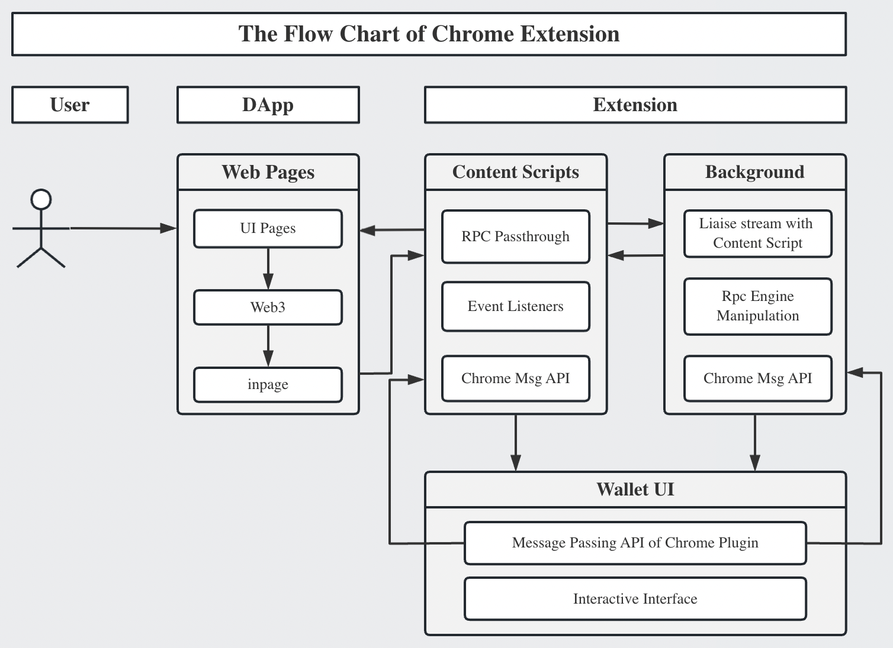

# The Simplest Chrome Extension

- Example 1: `plain-js-extension`
- Example 2: `npm-js-extension`

### Introduction



The project introduced several javascript files that are important to the extension and played different roles.
  - `before.js`, will be running at the start of the webpage (Note that, it is the active webpage you're accessing instead of the extension page. This is before the `DOMContentLoaded` event).
  - `after.js`, will be running at end of the webpage (Note that, the scripts run after the window's load event. This means the scripts run after the entire page has finished loading, including all synchronous and asynchronous scripts.)
  - `background.js`, is the tasks that you want to run in the background. For instance, add clicking listeners etc., so we add a listener `chrome.action.onClicked.addListener` for the clicking that user clicks on the top right corner of the browser. 
  - `execute.js`, is the file that is executed when user clicks the Extension icon on the top right corner of the browser. 
  - `inpage.js`, is the javascript file that will inject into the webpage.

<br/>

### CAUTION! Injecting code into the active tab of the webpage
[Reference Link](https://stackoverflow.com/questions/9515704/access-variables-and-functions-defined-in-page-context-using-a-content-script/9517879#9517879)
said that it injects a javascript file rather than just a snippet of code, and it's compatible in Manifest V3.

In `content_script.js` file, the code like below:
```
var s = document.createElement('script');
s.src = chrome.runtime.getURL('inpage.js');
s.onload = function() { 
  // As a best practice in script injection, you should always clean up after yourself and avoid leaving unnecessary artifacts in the DOM whenever possible.
  this.remove(); 
};
(document.head || document.documentElement).appendChild(s);
```

The `inpage.js` must be defined in the manifest.json
```
"web_accessible_resources": [{
  "resources": ["inpage.js"],
  "matches": ["<all_urls>"]
}]
```

<br/>

To learn more examples on how to develop Chrome extension, referred to the [Github repo](https://github.com/GoogleChrome/chrome-extensions-samples).


### The Caveats for Firefox Manifest
The standard specification of manifest.json file is identical to the Chrome, Brave, Opera broswers, but Firefox is different and it needs some slightly changes to the json file. The best practice to use extension on Firefox browser, I suggest you can check the validity of your extension by using the tool `addons-linter`.

Github repo: https://github.com/mozilla/addons-linter

you can install the tool into global environment with the command `npm install -g addons-linter`

finally, you need to package your extension by using the command `web-ext` which is published and maintained by Firefox.
Here is the introduction https://extensionworkshop.com/documentation/develop/getting-started-with-web-ext/

